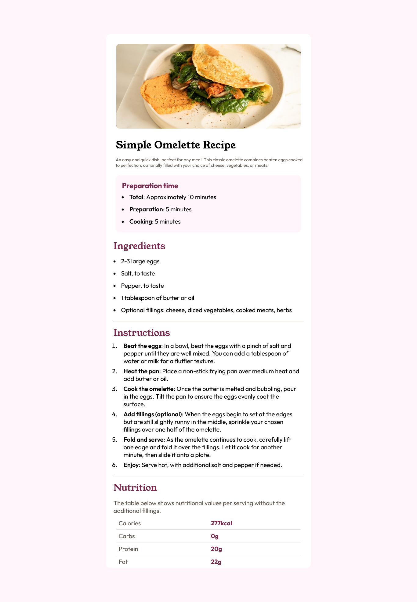

# Frontend Mentor - Recipe page solution

This is a solution to the [Recipe page challenge on Frontend Mentor](https://www.frontendmentor.io/challenges/recipe-page-KiTsR8QQKm). Frontend Mentor challenges help you improve your coding skills by building realistic projects.

## Table of contents

- [Overview](#overview)
  - [Screenshot](#screenshot)
  - [Links](#links)
- [My process](#my-process)
  - [Built with](#built-with)
  - [Useful resources](#useful-resources)
- [Author](#author)

## Overview

This is a recipe page, a simple omlette recipe .

### Screenshot



### Links

- Solution URL: [Solution](https://github.com/shaheerahmedkhan11/recipe-page-main)
- Live Site URL: [Live Site](https://shaheerahmedkhan11.github.io/recipe-page-main/)


## My process

### Built with

- Semantic HTML5 markup
- CSS custom properties
- Flexbox
- Mobile-first workflow
- [Styled Components](https://styled-components.com/) - For styles

```html
<h1>Some HTML code I'm proud of</h1>
<table>
        <tbody>
          <tr>
            <td>Calories</td>
            <td><strong>277kcal</strong></td>
          </tr>
          <tr>
            <td>Carbs</td>
            <td><strong>0g</strong></td>
          </tr>
          <tr>
            <td>Protein</td>
            <td><strong>20g</strong></td>
          </tr>
          <tr>
            <td>Fat</td>
            <td><strong>22g</strong></td>
          </tr>
        </tbody>
      </table>
```

```css
tbody tr:last-of-type td {
  border-bottom: none;
}
```

### Useful resources

- [MDN](https://developer.mozilla.org/en-US/) 
- [CSS Tricks](https://css-tricks.com/guides/) 

## Author

- Frontend Mentor - [@shaheerahmedkhan11](https://www.frontendmentor.io/profile/shaheerahmedkhan11)
